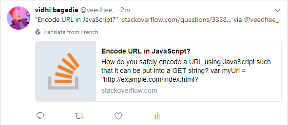
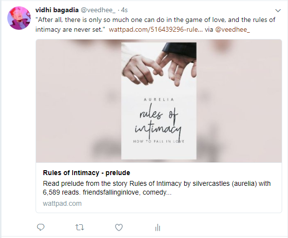

# Quote-Unquote

What it is:
* A Chrome Extension.
* Easy way to share websites you like.
* Easy way to share paragraphs/snippets you like.
* SUpports most social platforms.
* Fun.

What it is not:
* A fully developed extension.
* Random quote generator.
* Boring.

## Getting Started

To install and run this extension, follow the instructions below:
 * Download the ZIP/ clone the project to your local machine.
 * Open Chrome Browser.
 * Click on the three dots menu at the top right corner of your screen, and goto ``` More Tools ``` and then choose ``` Extensions ```.
 * Check the ``` Developer Mode ``` option.
 * Click ```Load Unpacked Extension``` and choose the location of the downloaded Quote Unquote project.
 * You will see the extrnsion being loaded in your URL bar in a few seconds, a blue icon appears.
 
 How to use:
 * Select any text on a website.
 * Click the blue icon of Quote Unquote.
 * Select the platform you want to share it to.
 * A window will appear allowing you to make changes before sharing.
 
 ## Format of the shared data
 
 The text that is shared will be of the format:
 
``` "{your text here}" {url of the website you are sharing it from} ```

Different websites will adjust to the URL accordingly, giving in a preview of the website.
Some platforms restrict the prefilling of text, so only the URL field gets shown with a preview.

The URL of the website is added so as to attribute to the right owner.

## Understand the Basics

* [manifest.json](manifest.json)
This is the first file that the browser reads. It contains all the meta data, and specifies the background scrits, content scripts, pop up details, action to be performed on browser/ pages.
Find more details about the manifest file [here] (https://developer.chrome.com/apps/manifest).

* [popup.html](popup.html)
If you see the ```manifest.json```, you will find the default pop-up as ```popup.html```. This is the default html that shows up when you click on the extension icon.

* [style.css](style.css)
It is the CSS that is applied to the ```popup.html```.

* [popup.js](popup.js)
This is the JS script that works on the html. It handles everything from extracting the selected text, extracting the tab url, fitting these into appropriate parameters, and linking these to a share web intent.

* [Quote.png](Quote.png)
The icon image. You can find it assigned in the ```manifest.json``` file.

* [font-awesome.min.css](font-awesome.min.css)
CSS file for the Platform Logos. Can be downloaded or used via CDN.

You can read more about Building Chrome Extensions [here](https://developer.chrome.com/extensions).

## Issues/ TODO

* Better UI (maybe a div that pops up on selecting any text).
* Facebook does not give an option to prefill with the ```text```. A work-around for it.
* Modifying it so that it fires up just fine on other browsers too, more importantly, Firefox. (I love FIrefox)
* Occasional moving of the end quote mark to the next line.

## Examples/ Where can it be used?

Because I'm too lazy to sign in on my other accounts and Twitter is the only place Open right now, the screenshots will only be from twitter. Will be updated gradually.

Can be used to share an answer to a StackOverflow problem, or share a question.


Can be used to share your favourite lines from a book.


The possibilities to share what you love is limitless.

## Note from yours truly (gitignore if you want)

If there's one language that has constantly given me a tough time, it's JavaScript. I don't even know why.
It's useful. It's syntax is pretty clear to me. It fits well with HTML.
But it gives me hard time nonetheless.

Picking up this project was what seemed to me like the perfect way to lower my morale. I had no experience with extensions, and no experience with JavaScript. But I was pretty organized in the head on what I wanted to make.
After reading the official documentation for a while, and leaving it hundred times in between before abandoning it right at the middle, I took to reading a few (read: two) extension codes.
After spending hours on understanding callbacks and chrome API and everything in between, this is the product of a Weekend Project which I completed in two days.

This was fun.
